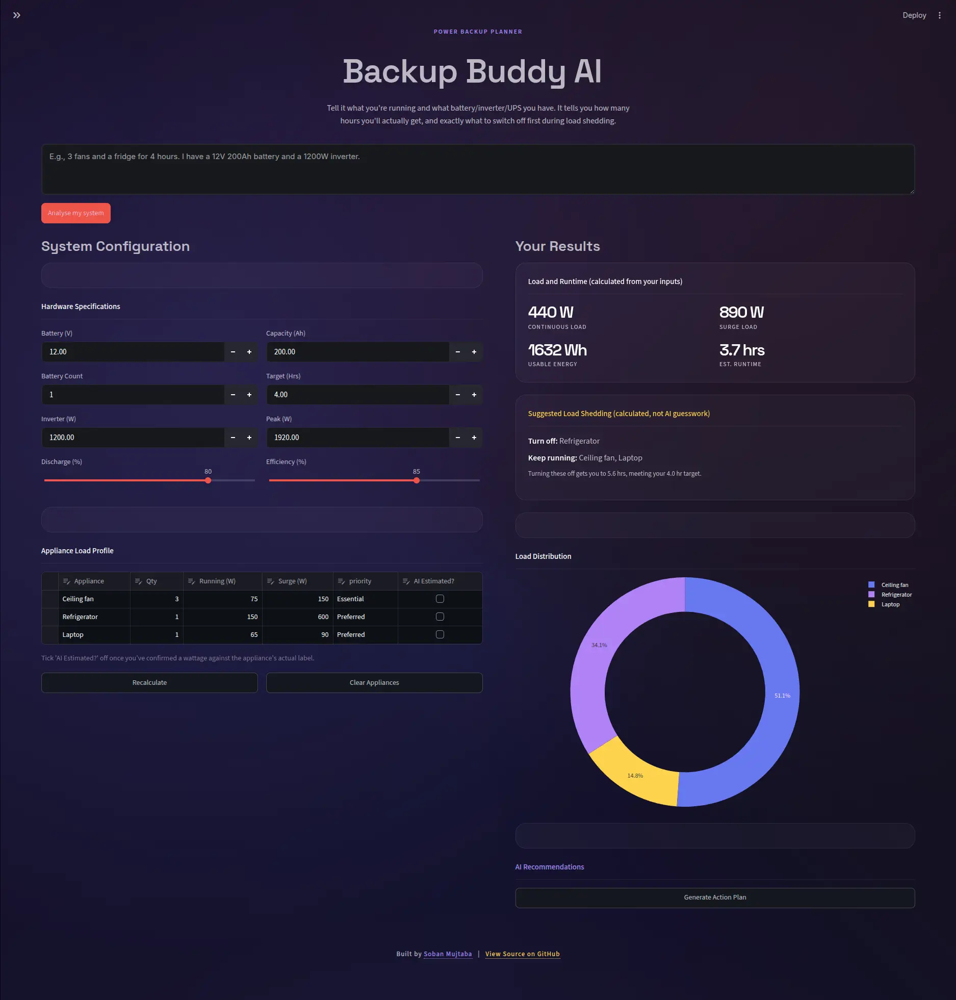

# Backup Buddy AI

## What it does and who it's for

Backup Buddy AI is a calculator for households in Pakistan (or anywhere with regular power outages) who own, or are about to buy, a UPS, battery bank, inverter, or solar backup system.

Instead of relying on guesswork or sales recommendations, the app calculates:

- Continuous power consumption of all appliances
- Startup surge requirements
- Estimated battery backup time
- Inverter load utilisation and safety margin
- Which appliances should be turned off first if the desired runtime cannot be achieved
- A plain-language explanation and usage plan generated using AI

All electrical calculations (load, runtime, inverter sizing, safety checks, and load shedding) are performed using deterministic Python logic.

[backupbuddyai.streamlit.app](https://backupbuddyai.streamlit.app/)

Artificial Intelligence is **only** used to:

- Extract structured appliance and hardware information from natural language
- Explain the already-calculated results in plain English

This guarantees that every numerical result is reproducible and never AI-generated.

---

## Live Demo

https://backupbuddyai.streamlit.app/

---

## Features

- **Two ways to add appliances**: describe them in a sentence ("3 fans, a
  fridge, and WiFi for 4 hours, on a 12V 200Ah battery") or add rows
  manually.
- **AI appliance + hardware extraction**: the free-text description is
  parsed into a structured appliance list (name, quantity, running watts,
  surge watts, priority) and, if mentioned, battery/inverter specs too.
  Wattages are matched against a 29-item reference table where possible;
  anything outside the table is estimated and flagged as `estimated: true`
  so it's never presented as a measured fact.
- **Editable appliance table**: every AI-generated or manually-entered row
  can be corrected before anything is calculated.
- **One-click demo scenario**: fills in a working appliance list and
  hardware spec instantly, without any AI call, so the calculation and
  load-shedding logic can be verified even without a Gemini API key.
- **Backup runtime calculator**: usable battery energy and estimated
  runtime, computed from voltage, capacity (Ah), battery count, safe
  discharge depth (%), and inverter efficiency (%) — all of these are
  live inputs, not fixed constants.
- **Inverter safety check**: continuous load vs. inverter rating, and a
  worst-case surge estimate (all appliances running plus the single
  largest motor-start jump) vs. the inverter's peak rating. Status is
  Optimal below 85% of rating, Marginal between 85-100%, Overloaded above
  100% of either rating.
- **Priority-based load shedding**: if the runtime target isn't met, the
  app removes Optional appliances first, then Preferred (largest load
  first within each group), and shows exactly which ones and the
  resulting new runtime. Essential appliances are never removed
  automatically.
- **AI usage plan**: a plain-language explanation of the results plus a
  practical schedule, generated from the calculated numbers.
- **Charts**: load contribution per appliance, plus live status readouts
  for continuous/surge draw as a percentage of inverter rating.

---

## AI Features

Backup Buddy AI uses **Groq's OpenAI-compatible API** running:

**Model:** `llama-3.3-70b-versatile`

Two independent AI prompts are used.

### 1. Appliance & Hardware Extraction

Converts free-text descriptions into structured JSON.

Example:

```text
"3 fans, one refrigerator and Wi-Fi on a 12V 200Ah battery for 4 hours"
```

becomes

```json
{
  "appliances": [
    {
      "name": "Fan",
      "quantity": 3,
      "running_watts": 75,
      "surge_watts": 75,
      "priority": "Preferred",
      "estimated": true
    }
  ],
  "required_hours": 4,
  "system_specs": {
    "battery_voltage": 12,
    "battery_capacity_ah": 200,
    "battery_count": 1,
    "inverter_rating": 0,
    "inverter_peak_rating": 0
  }
}
```

The extractor:

- Uses a reference wattage database whenever possible.
- Flags estimated wattages.
- Never invents missing values.
- Returns JSON only.

---

### 2. Backup Planning Advisor

Receives only the calculated results and generates a user-friendly report including:

- System assessment
- Runtime analysis
- Load shedding recommendations
- Optimisation advice
- Safety warnings
- Estimated energy savings

The AI never performs electrical calculations itself.

---

## Screenshot

## Technology Stack

## How to run locally
=======
- **Python**
- **Streamlit**
- **Pandas**
- **Plotly**
- **OpenAI Python SDK**
- **Groq API**
- **Llama 3.3 70B Versatile**
- **Streamlit Community Cloud**

---

## Assumptions & Limitations

- Unknown appliance wattages are estimated and clearly marked.
- Worst-case surge assumes one motor starts while every other appliance is already running.
- Solar panel wattage can be interpreted as inverter rating when explicitly mentioned.
- If no inverter peak rating is provided, the app assumes **1.6×** the continuous rating.
- AI extraction may occasionally require manual correction.
- This application is intended as a planning tool and does **not** replace professional electrical advice.

---

## Run Locally

```bash
git clone https://github.com/sobanmujtaba/BackupBuddyAI.git

cd BackupBuddyAI

pip install -r requirements.txt

# Create Streamlit secrets
cp .streamlit/secrets.toml.example .streamlit/secrets.toml

# Add your Groq API key
GROQ_API_KEY="your_api_key"

streamlit run app.py
```

---

## Project Structure

```
BackupBuddyAI/
│
├── app.py
├── requirements.txt
├── assets/
├── .streamlit/
│   ├── secrets.toml.example
│   └── config.toml
└── README.md
```

---

## License

This project is intended for educational and personal use.
Electrical installations should always be verified by a qualified electrician.